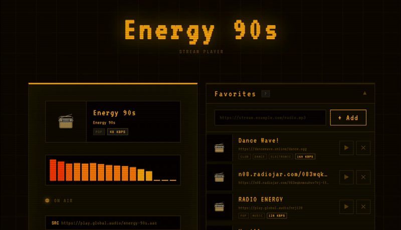
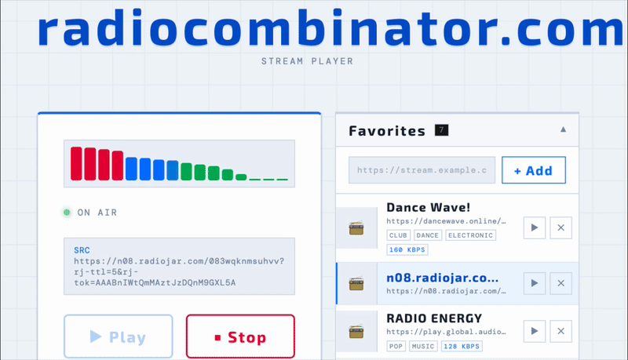

A **single‑page radio stream player** — entirely client‑side, zero backend — built for discovering, browsing, and listening to online radio stations.

Live at: https://play.radiocombinator.com


---

## Features

- **Search radio streams** using the public API from [radio‑browser.info](https://radio-browser.info)
- **Favorites list** — save your favorite stations in browser localStorage
- Play streams directly in the browser
- **Theme support**
  - Customizable UI via CSS themes
  - Includes multiple built‑in themes
  - Supports animations and dynamic UI changes using CSS variables
- Themes are modular — you are welcome to contribute!

---

## How It Works

This is a **pure client‑side app** built with standard web technologies:

- HTML
- CSS (themes, variables, animations)
- JavaScript

No server logic — all data fetching, UI interaction, and state persistence runs in the browser.

---

## Usage

1. Open https://play.radiocombinator.com in any modern browser.
2. Use the search bar to find radio stations by name, genre, country, or tag.
3. Click a station to play it.
4. Add stations to your **Favorites** list — stored locally in your browser.
5. Switch themes via the theme selector to instantly change the app’s look & feel.

---

## Theming

Themes power the UI customization experience. Each theme is:

- A **single CSS file**
- Uses CSS variables for colors, fonts, animations, and transitions
- Automatically loaded at runtime

### Built‑in Themes

<table>
  <tr>
    <td></td>
    <td></td>

  </tr>
  <tr>
    <td></td>
    <td></td>
  </tr>
</table>

### Contribute Your Own Theme

Want your theme included?

1. Create a `.css` file defining your variables and styles.
2. Follow the theme structure described in [THEME_GUIDE.md](./THEME_GUIDE.md)
3. Submit a pull request!

Your theme can change:
- Colors
- Fonts
- Layout tweaks
- Animated effects
- And more

---

## Development

**Requirements**

No backend required — just a static host or local development server.

**Getting Started**

```bash
git clone https://github.com/skkdevcraft/play-radio-web.git
cd play-radio-web/src
open index.html
```

Use your preferred local server (e.g., `live-server`, `http-server`) for hot reload and testing.

---

## Radio Browser Integration

The app uses the **radio‑browser.info** API to search and retrieve stream metadata.

Useful endpoints:

* Search by name, tag, country
* Stream URLs
* Station metadata (favicon, bitrate, tags)

---

## Favorites

Favorites are persisted using **localStorage**.

Stored data:

* Station ID
* Name
* Stream URL
* Favicon
* Any custom metadata

---

## FAQ

**Can I host this myself?**
Yes! It’s just static files — you can host on Netlify, GitHub Pages, Vercel, or any static host.

**How do themes load?**
Themes are CSS files loaded via JavaScript and applied using CSS variables.

---

## Contributions

All contributions are welcome!
Whether it's:

* Bug fixes
* New themes
* UX improvements
* Feature proposals

Please read `CONTRIBUTING.md` before submitting.

---

## License

Distributed under the MIT License.